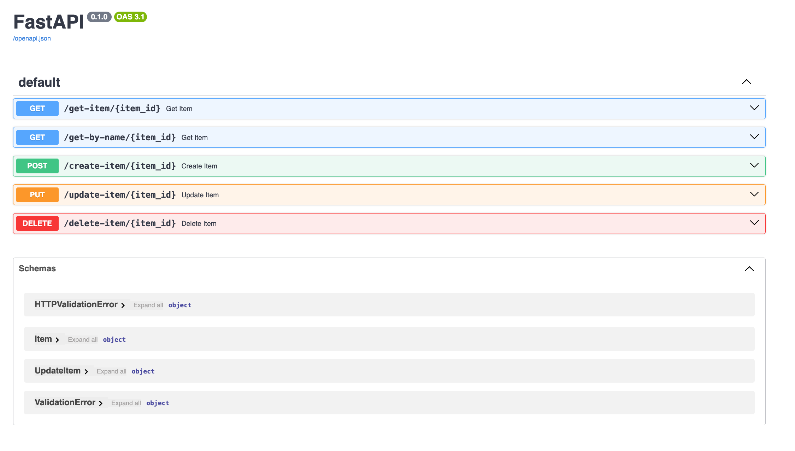
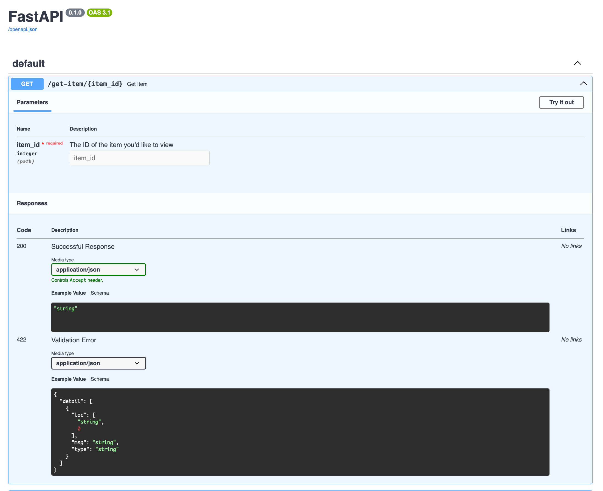

### Advantages of FastAPI

- it's fast (the clue is in the name)
  - very performant - uses types that allow you to skip lots of validation
- automatically produces documentation
- the typing allows for hinting when using VSCode

### Setup Steps

#### Clone the repo

#### Create a Virtual Environment

`python -m venv venv`

`source venv/bin/activate`

#### Install fastapi and uvicorn

`pip install fastapi`

`pip install uvicorn`

#### Run the App using Uvicorn

`uvicorn working:app --reload`

Go to `http://127.0.0.1:8000/docs' to see the documentation

### Trying out the APIs

Click on the down arrow on the API you want to try

Click the "Try it out" button

Add the relevent details and click the "Execute" button to see the APIs in action

### Starting out

You'll need to use the `/create-item/{item_id}` endpoint to create an item to interact with before you can use the other endpoints
